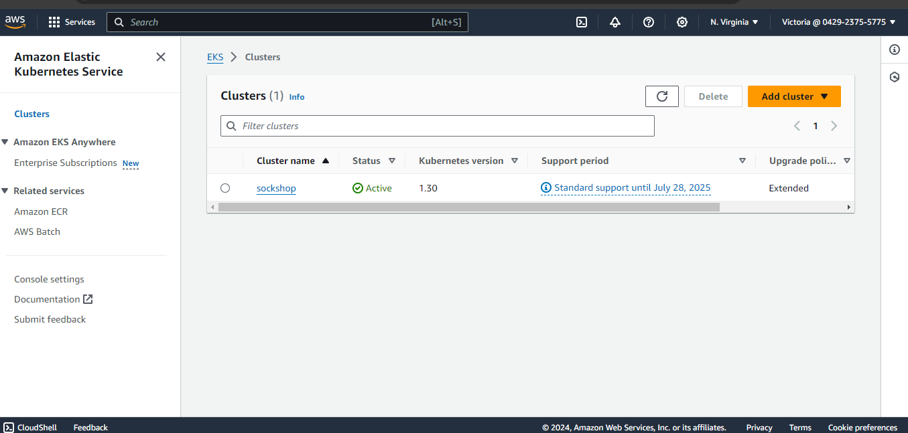
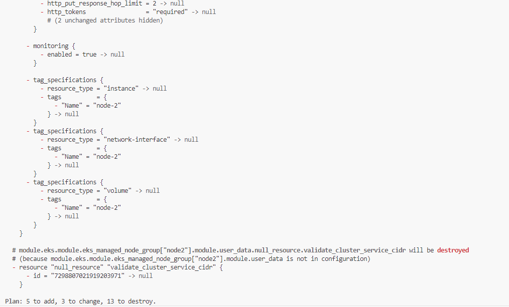
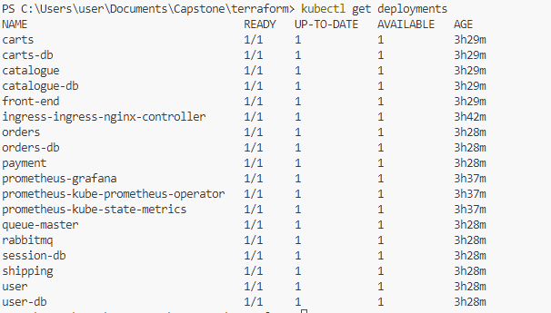
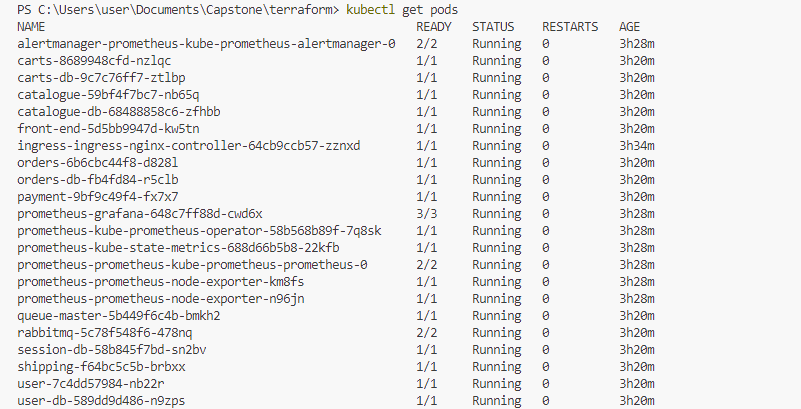
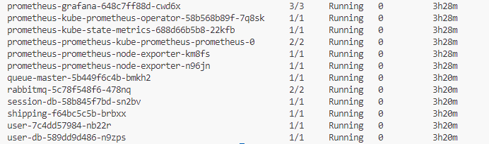
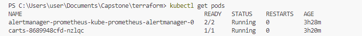
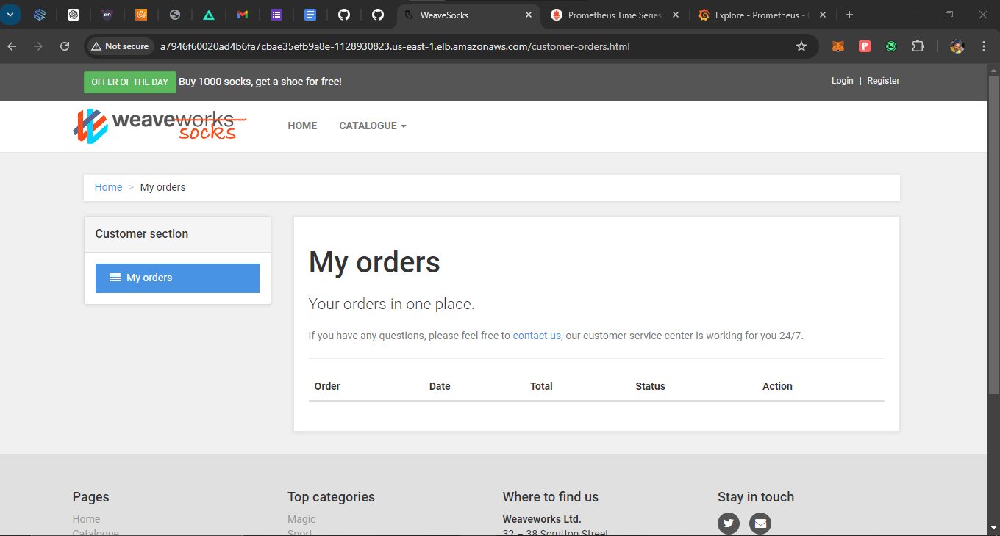
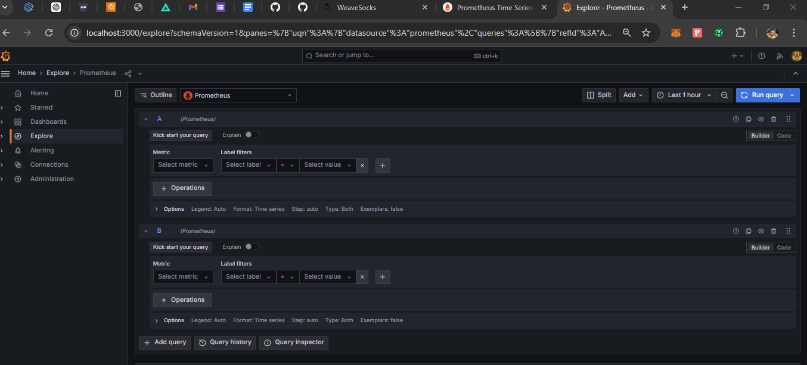
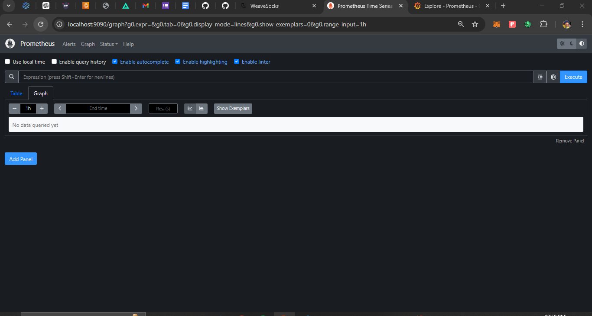

CAPSTONE PROJECT

Objective

We aim to deploy a microservices-based application, specifically the Socks Shop, using a modern approach that emphasizes automation and efficiency. The goal is to use Infrastructure as Code (IaaC) for rapid and reliable deployment on Kubernetes.

Tasks:

* Deploying pipeline using Amazon EKS (Elastic Kubernetes Service)
        

* Using Terraform as the configuration management tool
         
         
         

* The application running on Kubernetes

  
  

  * Using Prometheus as a monitoring tool

  

* Metrics Alertmanager

   

* Accessing through load balancer

 

* Monitoring Grafana

   

* Logging Prometheus

   

[subscribe](https://www.youtube.com/@njokuvictoria8986)
